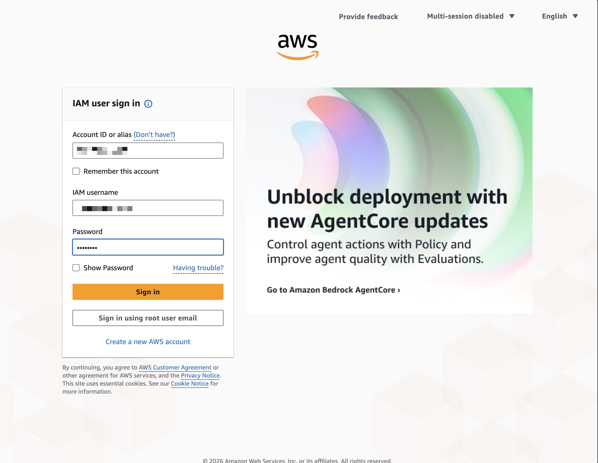
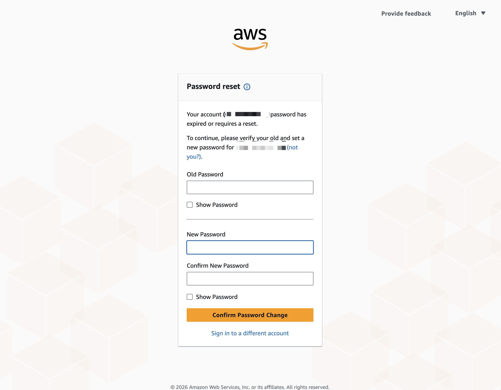
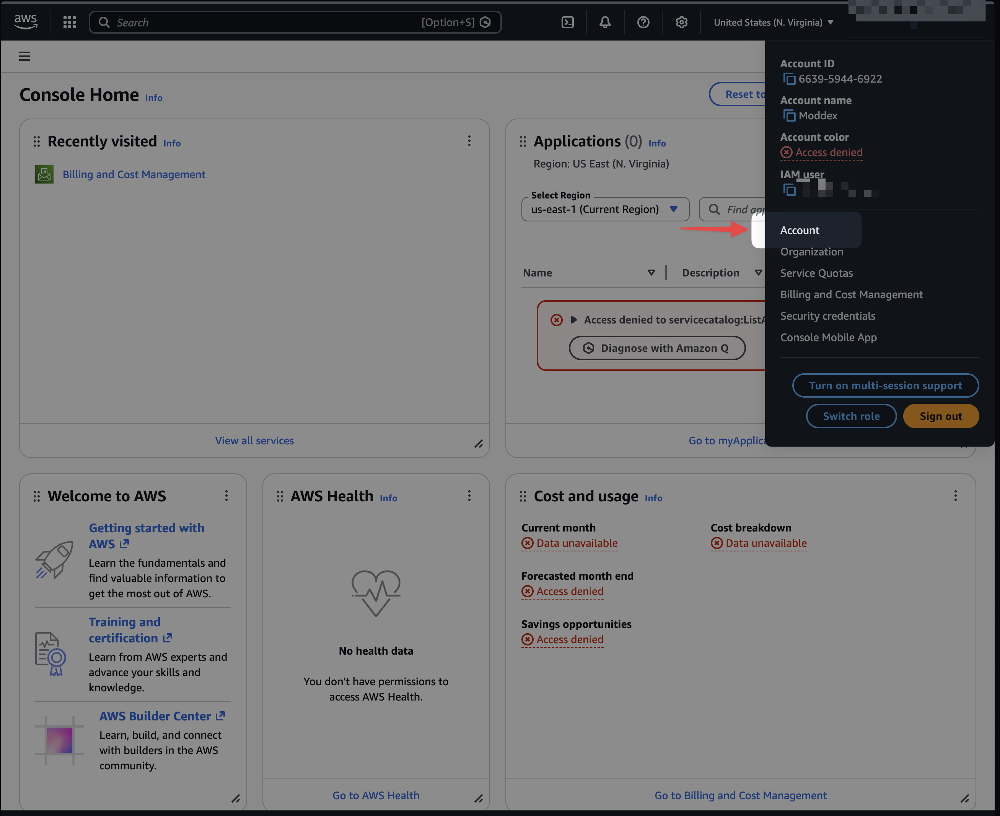
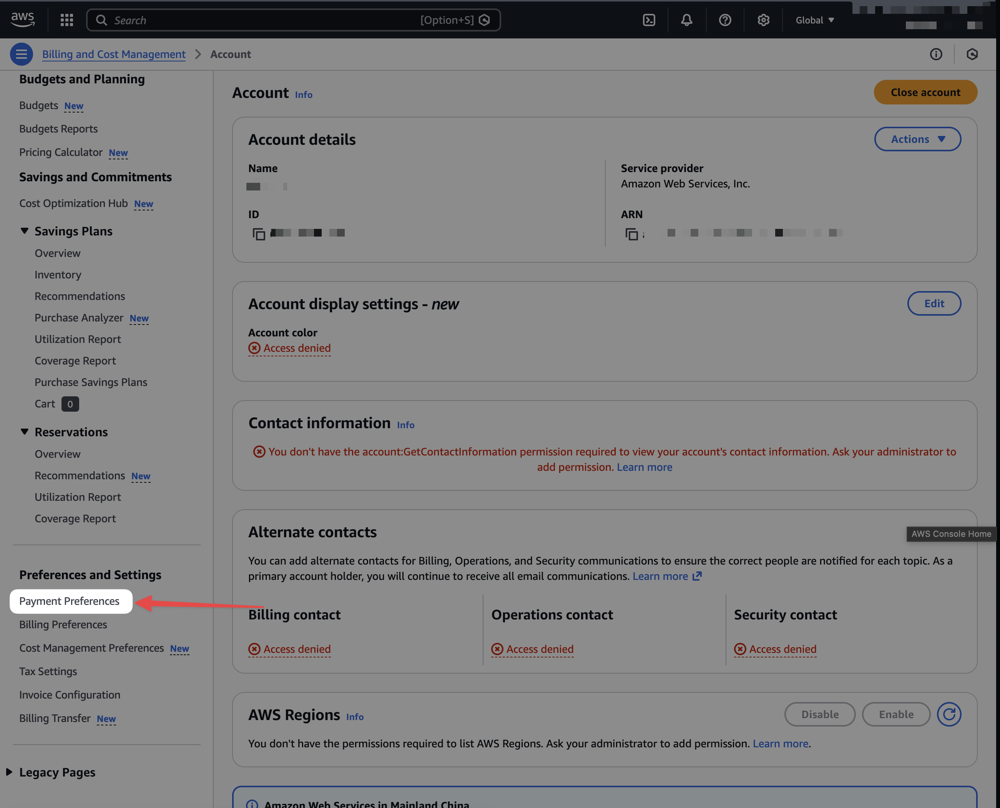
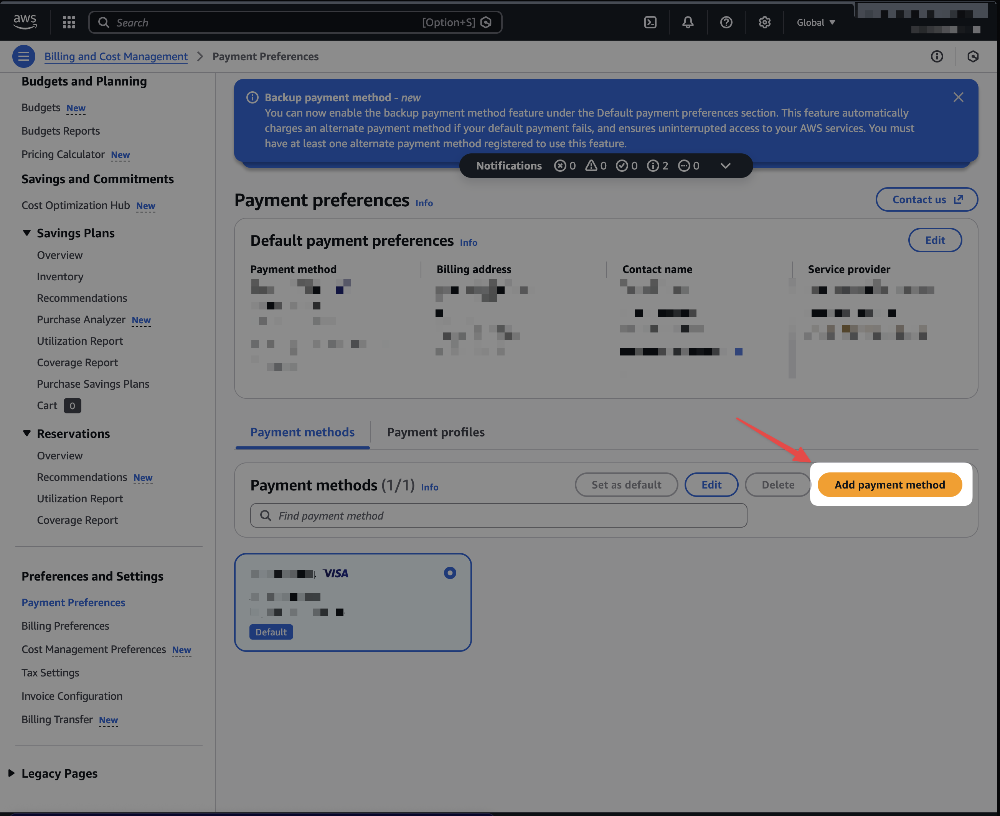

# AWS Partner Billable User Setup Instructions

These are instructions that a RoleModel employee may send to a partner on how to add a credit card to the Amazon AWS account under a provided billing user. The credentials for the login will be sent to the partner with the url. The url will take them to a page like this.

