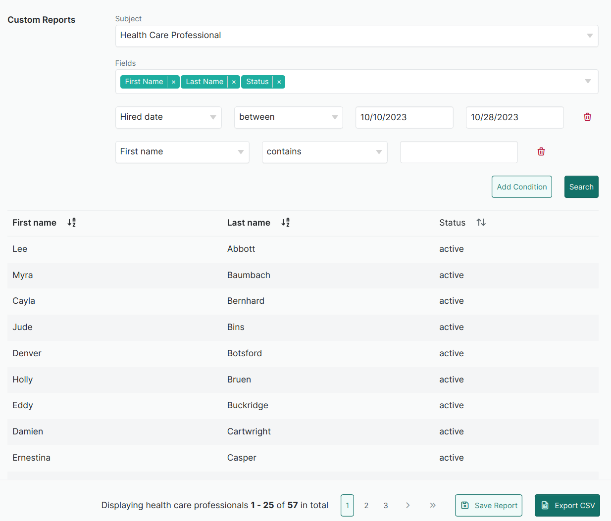

# Search

## Rationale

Many web applications include tables or grids of data that can be searched, sorted, filtered and paginated. There are some patterns and tools we have found useful when implementing data grids. [Ransack](https://github.com/activerecord-hackery/ransack) helps create advanced search forms using predicates and search matchers which can be encoded directly into URL params. With some front-end interactivity, it's possible to build a multi-model, multi-attribute, filterable search.



Data grids include pagination and for that we have found [Kaminari](https://github.com/kaminari/kaminari) to work. Another gem for full text search in PostgreSQL is [pg_search](https://github.com/Casecommons/pg_search).

When dealing with nested associations or other complex joins, a database view makes implementing data grids easier. [Scenic](https://github.com/scenic-views/scenic) makes it possible to create SQL views and update them using migrations.

All of these tools work well with each other so we mix and match as needed.

## Better Search

### Use HTTP GET requests
Encoding search params in URLs allows discoverability, shareability, and extensibility.

🟥 Bad
```ruby
<%= search_form_for @q, html: { method: :post } do |f| %>
```

🟩 Good
```ruby
<%= search_form_for @q do |f| %>
```

Note that there is an [advanced mode](https://github.com/activerecord-hackery/ransack/blob/fb6027d805997a7856a5b4b67d98c35afd46f8e5/docs/docs/getting-started/advanced-mode.md) that may require use of HTTP POST because queries could exceed the character limits of URLs.


