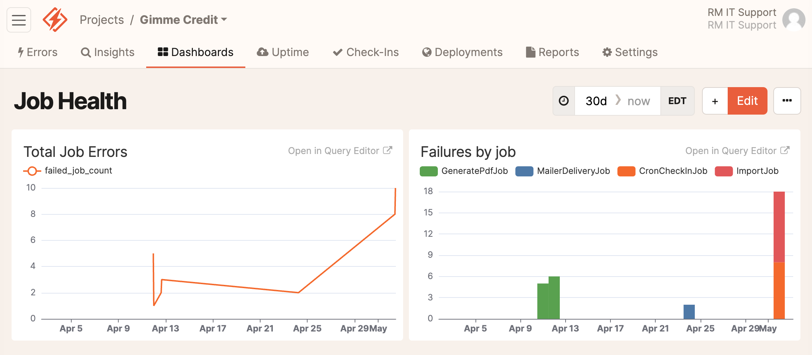

## [Home](../README.md)

# Background Jobs

## Checklist
As a rule of thumb, any project that uses background jobs should ensure that the following capabilities are in place.

1. [Error logging](#error-reporting-honeybadger)
2. [Job retries](#job-retries)
3. [Job cleanup](#job-cleanup)
4. [Management console authentication](#management-console-authentication)

## Which queue adapter?

### Solid Queue vs Good Job
RoleModel has standardized on [Good Job](https://github.com/bensheldon/good_job?tab=readme-ov-file) as its Active Job queue adapter preference since 2020. [37 Signals created Solid Queue](https://dev.37signals.com/introducing-solid-queue/) and released it in December of 2023 which has become the default adapter shipping with Rails 7. Despite the excitement of the shiny, new, out-of-the-box codebase, it is not obvious that this should be RoleModel's adapter of choice for existing and new projects. The creator of Good Jobs has [expressed his excitement](https://island94.org/2023/12/solid-queue-first-impressions) about Solid Queue coming into Rails but has reiterated his committment to continuing Good Job's development, [claiming that it will continue to offer](https://island94.org/2023/10/reflections-on-good-job-for-solid-queue) some advantages over Solid Queue. Solid Queue appears to be headed in the right direction but is not as feature-rich as Good Job, it will not be as flexible since it is a more streamlined implementation, it uses 9 database tables which seems heavy handed, and it has some known minor drawbacks (such as polling intead of Postgres Listen/Notify).

Given these facts, it is not obvious which adapter should be recommended for a new RoleModel project. If a project currently uses Good Job and is not on the latest version, it seems like upgrading Good Job to latest version will give the best overall experience (based on the research done in May, 2024). For a new project, it does not seem like Solid Queue has any real advantages over Good Job that would make it the obvious choice. Good Job has more functionality, and with the sensible defaults listed below, it should be just as easy to get up and running with all the bells and whistles ready to go.

## Good Job Best Practices

### Migration path
When migrating to a new major version of Good Job, you'll need to upgrade to the current version's x.99 version and release it to support backward compatibility with new jobs using the next `x + 1` version's job format. After it is released and all old versioned jobs are drained from the queue, then you can upgrade to the latest version of `x + 1` following the steps in their project [README](https://github.com/bensheldon/good_job?tab=readme-ov-file#updating).

With the goal of getting to the preferred configuration, below are the configurations needed to maintain (or get to) the preferred configuration.

#### [From v1 to v2.0](https://github.com/bensheldon/good_job/tree/v3.28.2?tab=readme-ov-file#upgrading-v1-to-v2)
Steps:
0. Clean up old jobs with `bundle exec good_job cleanup_preserved_jobs --before-seconds-ago=1209600` (i.e. 14 days)
1. Update Gemfile to use `gem 'good_job', '~>1.99'`
2. `bundle update good_job`
3. `bin/rails g good_job:update` && `bin/rails db:migrate` (Update migrations for minor changes if necessary.)
4. Add job preservation configuration (`GoodJob.preserve_job_records = true`) to `config/initializers/good_job.rb`
5. Rename `GoodJob.reperform_jobs_on_standard_error` to `GoodJob.retry_on_unhandled_error`, if necessary.
6. Update `GOOD_JOB_QUEUES` variable per [Queue Management](#queue-management)
7. Address any deprecation warnings generated by v1.99
8. Create pull request and deploy after review
9. *** After deployment and queue is drained, change gem version to `2.0.0` and apply steps 2 through 8 again.

#### [From v2 to v3.0](https://github.com/bensheldon/good_job/tree/v3.28.2?tab=readme-ov-file#upgrading-v2-to-v3)
Steps:
0. Clean up old jobs with `bundle exec good_job cleanup_preserved_jobs --before-seconds-ago=1209600` (i.e. 14 days)
1. Update Gemfile to use `gem 'good_job', '~>2.99'`
2. `bundle update good_job`
3. `bin/rails g good_job:update` && `bin/rails db:migrate` (Update migrations for minor changes if necessary.)
4. Add job preservation configuration (`GoodJob.preserve_job_records = true`) to `config/initializers/good_job.rb`
5. Rename `GoodJob.reperform_jobs_on_standard_error` to `GoodJob.retry_on_unhandled_error`, if necessary.
6. Update `GOOD_JOB_QUEUES` variable per [Queue Management](#queue-management)
7. Address any deprecation warnings generated by v2.99
8. Create pull request and deploy after review
9. *** After deployment and queue is drained, change gem version to `3.0.0` and apply steps 2 through 8 again.

#### From v3.0 to latest v3.x
1. Update Gemfile to use `gem 'good_job', '~>3.29'`
2. `bundle update good_job`
3. `bin/rails g good_job:update` && `bin/rails db:migrate` (Update migrations for minor changes if necessary.)
4. Update configuration in `config/initializers/good_job.rb` to only include `smaller_number_is_higher_priority`, `queues`, and `execution_mode` overrides from `rolemodel_rails#good_job` generator.
5. Update `GOOD_JOB_QUEUES` variable per [Queue Management](#queue-management)
6. Address any deprecation warnings generated by v3
7. Create pull request and deploy after review

### Error reporting (Honeybadger)
We want to be alerted when jobs fail. Typically Honeybadger is added to a project to track errors and send alerts to Slack. If you are using both ActiveJob, and the honeybadger gem with v5.7.0 or later the gem will be notified of job errors and send them to the Honeybadger service. If your project is not using Honeybadger then you will want to add something like this to an initializer:

```ruby
ActiveJob::Base.set_callback(:perform, :around) do |param, block|
  begin
    block.call
  rescue StandardError => e
    # notify error service
    # re-raise the error
    raise e
  end
end
```

### Honeybadger Insights
[Honeybadger insights](https://docs.honeybadger.io/guides/insights/) are a feature that can be leveraged for visualizing failure trends in your jobs.

The two following queries can be a useful starting place for developing some of these useful charts. Charts can be named and added to the Honeybadger dashboard as well.

Make sure your Honeybadger version is passed 5.7.0 in order to collect the necessary meta data for the following queries.

**Total job failure chart:**

```sql
fields @ts, context.job_class::str, context.action::str, environment::str
| filter context.action == "perform"
| filter environment::str == 'production'
| stats count() as failed_job_count by bin(1h)
```

Click the "Line" dropdown to create a chart, and then click the settings icon on the right side. Set the X field to `bin(1h)` and the Y field to `failed_job_count`

**Job failure by job type:**
```sql
fields @ts, @preview, message::str, context.job_class::str, context.action::str, environment::str
| filter context.action::str == 'perform'
| filter environment::str == 'production'
| stats count(), context.job_class::str by bin(1d), context.job_class::str
```

Select the Histogram option from the chart dropdow and Configure the X field to be `bin(1d)`, the Y field to be `count()`, and the Z field to be `context.job_class`

The above configuration, when added to a dashboard, will look like this:




### Performance Monitoring (Skylight)
We also want to monitor things like the average duration of each job class, and be able to see why slow jobs are slow. That can be accomplished by adding an active_job skylight probe to your app's production.rb:

```ruby
  config.skylight.probes << 'active_job'
```

This will cause skylight to add a worker process similar to the web process.

### Concurrency
Sometimes it makes sense to [control the concurrency](https://github.com/bensheldon/good_job?tab=readme-ov-file#concurrency-controls) of a job. Imagine a page object that has an index method, that updates a search index. It doesn't make any sense to have multiple index jobs running at the same time for the same page. That policy can be enforced with a job configured like this:

```ruby
class PageIndexJob < ApplicationJob
  include GoodJob::ActiveJobExtensions::Concurrency

  good_job_control_concurrency_with(
    total_limit: 1,
    key: -> { "page_index-#{arguments.first.id}" }
  )

  def perform(page)
    page.index
  end
end
```

### Queue management
Active Job operates each job in a queue. If no custom queues are specified, all jobs will be in the "default" queue. We may want to instruct certain queues to only run a certain number of jobs at a time. You may want to avoid longer background jobs from blocking other short jobs or you may want to avoid a resource-heavy job (something that boots up Chrome, for instance) from performing in parallel.

There are [at least] two ways to specify the [queues configuration](https://github.com/bensheldon/good_job?tab=readme-ov-file#optimize-queues-threads-and-processes) for Good Job.

1) In the code:
```ruby
Rails.application.configure do
  config.good_job.queues = "large_task:#{max_large_tasks};-large_task"
end
```

2) As an environment variable
```ruby
ENV['GOOD_JOB_QUEUES'] = 'mailers:1;default:3;pdf:1;-pdf'
```

### Job retries
We want to ensure that jobs which fail for transient reasons (like a network issue) are retried automatically. For this reason jobs should be written in a way that is idempotent (able to be run multiple times and produce the same result). We also want to ensure that our job system is configured to automatically retry failed jobs by default. Because libraries like Noticed or Action Mailer do not inherit from your app’s ApplicationJob class, it is recommended to include the following configuration in an initializer (order is important, see `rolemodel_rails#good_job` generator):

```ruby
ActiveJob::Base.retry_on StandardError, wait: :polynomially_longer, attempts: 25

# Automatically retry jobs that encountered a deadlock
ActiveJob::Base.retry_on ActiveRecord::Deadlocked

ActiveJob::Base.discard_on ActiveJob::DeserializationError
ActiveJob::Base.discard_on ActiveRecord::RecordNotFound
```

### Cron
Projects often need to run jobs on a regular schedule. In the past RoleModel has used various options for this like the Heroku scheduler, or the `whenever` gem. However GoodJob has a built-in mechanism for [cron jobs](https://github.com/bensheldon/good_job?tab=readme-ov-file#cron-style-repeatingrecurring-jobs), that runs as part of your worker processes, which means that your cron job definitions can be version controlled and managed as part of the standard deployment process. In order to monitor the success (or failure) of cron jobs, we add a Honeybadger check-in which alerts us when the job has not been run on schedule. Below you will find a set of examples that show how to add cron jobs with Honeybadger check-ins to your project.

Define a good job initializer that enables cron jobs, and defines them `config/initializers/good_job.rb`:
```ruby
Rails.application.configure do
  config.good_job = {
    enable_cron: true,
    cron: {
      pghero_capture_stats: {
        cron: 'every 5 minutes',
        class: 'PgHeroCaptureJob'
      },
      pghero_clean_stats: {
        cron: 'every day at 2am EST',
        class: 'PgHeroCleanJob'
      }
    }
  }
end
```

Define the CheckIn concern which will perform a check-in after a job succeeds `app/jobs/concerns/check_in.rb`:
```ruby
module CheckIn
  extend ActiveSupport::Concern

  included do
    after_perform do |job|
      CheckInJob.perform_later(source_job_id: job.job_id.to_s, source_job_class: job.class.to_s)
    end
  end
end
```

Define the CheckInJob which performs the Honeybadger check-in `app/jobs/check_in_job.rb`:
```ruby
class CheckInJob < ApplicationJob
  def perform(source_job_id:, source_job_class:)
    key = Rails.application.config.honeybadger_check_in_config[source_job_class]
    raise 'Check-in failed' unless Honeybadger.check_in(key)
  end
end
```

Define the `honeybadger_check_in_config` in `config/application.rb`:
```ruby
# This expects an environment variable to be defined with a value like this: 'Job1:key1,Job2:key2'. The key values can be acquired when setting up a Honeybadger check-in.
config.honeybadger_check_in_config = ENV.fetch('HONEBADGER_CHECK_IN_CONFIG', '').split(',').to_h { |e| e.split(':') }
```

### Job cleanup
To avoid taking up unnessary amounts of database space, old jobs should be deleted from the database backend. Good Job handles this by default in version 3, but not in version 1 or 2.

In version 2, jobs were **not** preserved by default and you needed to specify if you wanted them to stick around (and manually run the command to clean them up if you do want to preserve).

You can read more about the defaults changing [here](https://github.com/bensheldon/good_job/tree/v3.0.2?tab=readme-ov-file#upgrading-v1-to-v2), but if you upgrade to version 3, you should have this capability in place with Good Job. Good job defaults to keeping jobs for 14 days. You can specify that duration if you would like it to be longer.

### Management console authentication
Good Job provides a user interface to interact with its jobs while the app is running at "my-rails-app.com/good_job." Most of the time, you will want to prevent every user from having access to these pages. A simple way to do this is to mount the Good Job engine within an `authenticate` block in the routes file.

```ruby
authenticate :user, ->(user) { user.admin? } do
  mount GoodJob::Engine => 'good_job'
end
```

## Miscellaneous Best Practices

### UI update patterns for progress
It is often useful to update the user interface regarding the status of a background job. If your application uses Hotwire, a handy way to do this is to leverage [Turbo::Broadcastable](https://rubydoc.info/github/hotwired/turbo-rails/Turbo/Broadcastable) in an after_perform hook:

```ruby
after_perform do |job|
  data = job.arguments.first
  Turbo::StreamsChannel.broadcast_update_to(['my_channel', data.id].join('_'), target: "id-of-div-to-replace", partial: "shared/my_partial", locals: {})
end
```
